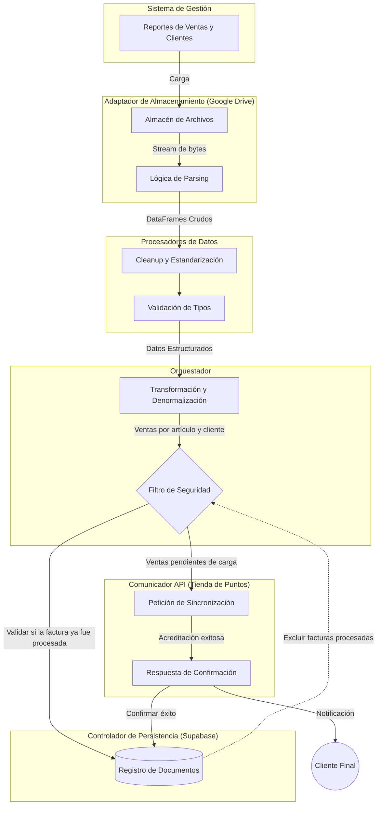
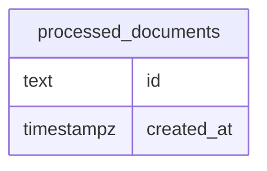

# Queen Helados - Points

Sistema automatizado de lealtad y recompensas que integra las ventas del sistema de gestión con la plataforma **Tienda de Puntos**, utilizando una arquitectura de adaptadores para máxima flexibilidad.

## 📋 Tabla de Contenidos

- [Introducción](#introducción)
- [Requisitos Previos](#requisitos-previos)
- [Arquitectura Modular](#arquitectura-modular)
- [Flujo de la Información](#flujo-de-la-información)
- [Configuración del Adaptador de Google Drive](#configuración-del-adaptador-de-google-drive)
- [Configuración del Adaptador de Supabase](#configuración-del-adaptador-de-supabase)
- [Configuración de las variables de entorno](#configuración-de-las-variables-de-entorno)

## Introducción

Esta integración resuelve la brecha entre el sistema de gestión utilizado actualmente, y una plataforma de fidelización mediante puntos: [Tienda de Puntos](https://www.tiendadepuntos.com/). El script procesa automáticamente las ventas, identifica a los clientes por su mail, y sincroniza la información para que la plataforma gestione los puntos.

## Requisitos Previos

- Gestor de paquetes `uv`.
- Cuenta en **Google Cloud Platform** (para la Google Drive API).
- Proyecto en **Supabase** para guardar las facturas procesadas.
- API Key de **Tienda de Puntos**.
- Acceso a los reportes `.xls` o `.xlsx` del sistema de gestión.

## Arquitectura Modular

El sistema está diseñado bajo el principio de inversión de dependencias, permitiendo que cada componente principal sea intercambiable mediante el uso de adaptadores y controladores genéricos.

### Adaptador de Almacenamiento (Storage Adapter)

Este módulo se encarga de la abstracción del origen de los archivos. Define una interfaz común para listar carpetas y descargar archivos como streams de bytes, permitiendo cambiar el proveedor de nube sin afectar la lógica de negocio.

La implementación actual es **Google Drive API v3**.

### Parser de Archivos (File Parser)

Responsable de interpretar la estructura física de los archivos descargados para transformarlos en estructuras de datos de memoria (DataFrames de Pandas).

La implementación actual es utiliza **Pandas** con el motor `xlrd` para soporte de archivos `.xls` y `openpyxl` para archivos `.xlsx`.

### Procesadores de Datos (Data Processors)

Módulos especializados en la lógica de limpieza y estructuración de cada tipo de reporte. Se encargan de tipar columnas, eliminar filas irrelevantes y estandarizar los datos crudos antes de que lleguen a la etapa de unión y denormalización.

La implementación actual permite procesar archivos de **Artículos** (`ArticlesProcessor`), **Detalle de Ventas por Artículo** (`SalesByArticleProcessor`), **Puntos de Venta** (`POSProcessor`) y **Listado de Clientes** (`ClientListProcessor`).

### Controlador de Persistencia (Persistence Adapter)

Su función principal es evitar el procesamiento duplicado de transacciones consultando y guardando las facturas que ya fueron procesadas.

La implementación actual es **Supabase**.

### Comunicador API (API Caller)

Módulo encargado de la salida de datos hacia servicios externos. Transforma la información denormalizada en el esquema JSON requerido por el receptor final.

La implementación actual es **Tienda de Puntos**, cuya documentación se encuentra en [docs.google.com/document/d/1gJn9klYxgWWrXO7AIfUrgvlEt4J-Wluz68o9elp9iGY/view](https://docs.google.com/document/d/1gJn9klYxgWWrXO7AIfUrgvlEt4J-Wluz68o9elp9iGY/view).

### Orquestador (Orchestrator)

Coordina el flujo de datos integral. Solicita los archivos al adaptador de almacenamiento, los procesa mediante los Data Processors correspondientes y finalmente realiza la denormalización (joins) de las diferentes fuentes para consolidar una única entidad de venta por factura.

## Flujo de la Información



## Configuración del Adaptador de Google Drive

El adaptador de Google Drive utiliza una arquitectura de seguridad **Zero Trust**, implementando **Application Default Credentials (ADC)** y **Workload Identity Federation (WIF)** para gestionar el acceso sin almacenar credenciales estáticas. A continuación, se detallan los pasos para configurar la infraestructura requerida.

### Fase 1: Configuración en Google Cloud

Antes de interactuar con el código, es necesario preparar la infraestructura en la nube de Google utilizando la cuenta de desarrollo.

1. Ingresar a Google Cloud Console.
2. Crear un proyecto nuevo o seleccionar uno existente.
3. Tomar nota del **ID del Proyecto** (`PROJECT_ID`) y del **Número del Proyecto** (`PROJECT_NUMBER`).
4. Ir a **APIs y Servicios > Biblioteca**, buscar **Google Drive API** y hacer clic en **Habilitar**.
5. Buscar **IAM Service Account Credentials API** y hacer clic en **Habilitar**.

### Fase 2: Despliegue en Producción (GitHub Actions)

Para que el sistema se ejecute de forma autónoma en GitHub sin exponer contraseñas, se configura un entorno de confianza (WIF) y una cuenta de servicio.

#### 1. Crear la Service Account y asignar permisos en Drive

Esta será la identidad oficial del automatismo.

1. En Google Cloud Console, ir a **IAM y administración > Cuentas de servicio**.
2. Crear una nueva cuenta.
3. Tomar nota de su correo electrónico. Este valor corresponderá a la variable de entorno `GDRIVE_TARGET_SERVICE_ACCOUNT`.
4. Ir a Google Drive web, hacer clic derecho sobre la carpeta raíz que contiene los archivos de Excel y compartirla con permisos de **Lector** a este correo electrónico.

> [!NOTE]
> No es necesario que la cuenta de desarrollo tenga acceso a esta carpeta de Drive; el acceso solo es necesario para la Service Account.

#### 2. Crear el Pool y el Provider (WIF)

Ejecutar los siguientes comandos en la terminal de Google Cloud Shell. Reemplazar `PROJECT_ID`:

```bash
# Crear el Pool (Grupo de confianza)
gcloud iam workload-identity-pools create "github-pool" \
  --project="PROJECT_ID" \
  --location="global" \
  --display-name="GitHub Actions Pool"

## Crear el Provider (Vincular a GitHub)
gcloud iam workload-identity-pools providers create-oidc "github-provider" \
  --project="PROJECT_ID" \
  --location="global" \
  --workload-identity-pool="github-pool" \
  --display-name="GitHub Provider" \
  --attribute-mapping="google.subject=assertion.sub,attribute.actor=assertion.actor,attribute.repository=assertion.repository" \
  --attribute-condition="assertion.repository == 'USERNAME/REPOSITORY'" \
  --issuer-uri="https://token.actions.githubusercontent.com"
```

#### 3. Otorgar permisos al Repositorio de GitHub

Este comando autoriza al repositorio a usar la identidad de la cuenta de servicio. Reemplazar `SERVICE_ACCOUNT_EMAIL`, `PROJECT_ID`, `PROJECT_NUMBER`, `USERNAME` y `REPOSITORY`.

```bash
gcloud iam service-accounts add-iam-policy-binding "SERVICE_ACCOUNT_EMAIL" \
  --project="PROJECT_ID" \
  --role="roles/iam.workloadIdentityUser" \
  --member="principalSet://iam.googleapis.com/projects/PROJECT_NUMBER/locations/global/workloadIdentityPools/github-pool/attribute.repository/USERNAME/REPOSITORY"
```

#### 4. Configurar Variables en GitHub

Inyectar los identificadores en la configuración del repositorio para que el pipeline funcione.

 1. Ir al repositorio en GitHub.
 2. Navegar a **Settings > Secrets and variables > Actions > Variables**.
 3. Hacer clic en **New repository variable** y agregar:

- **GCLOUD_WIF_PROVIDER**: projects/PROJECT_NUMBER/locations/global/workloadIdentityPools/github-pool/providers/github-provider *(reemplazando PROJECT_NUMBER)*.
- **GDRIVE_TARGET_SERVICE_ACCOUNT**: El correo electrónico de la cuenta de servicio.
- **GDRIVE_FOLDER_ID**: El ID alfanumérico de la carpeta en Google Drive.

### Fase 3: Preparar el Entorno Local (WSL / Ubuntu)

Para ejecutar y probar el código localmente, se debe configurar la CLI de Google Cloud y solicitar un pase temporal vinculado a tu identidad de desarrollador. Esto permite al script impersonar a la Service Account de manera segura.

#### 1. Instalar dependencias y la CLI

```bash
# Instalar dependencias de seguridad
sudo apt update
sudo apt install apt-transport-https ca-certificates gnupg curl

# Descargar la llave criptográfica pública de Google
curl https://packages.cloud.google.com/apt/doc/apt-key.gpg | sudo gpg --dearmor -o /usr/share/keyrings/cloud.google.gpg

# Agregar el repositorio
echo "deb [signed-by=/usr/share/keyrings/cloud.google.gpg] https://packages.cloud.google.com/apt cloud-sdk main" | sudo tee -a /etc/apt/sources.list.d/google-cloud-sdk.list

# Instalar Google Cloud CLI
sudo apt update
sudo apt install google-cloud-cli
```

#### 2. Autenticación Local

Ejecutar el login y vincular el proyecto para evitar errores de cuota de API (reemplazar PROJECT_ID):

```bash
gcloud auth application-default login
gcloud auth application-default set-quota-project PROJECT_ID
```

#### 3. Permisos de Impersonación Local

Para que la impersonación funcione a nivel local, tu cuenta personal debe tener permiso para generar tokens en nombre de la Service Account. Ejecuta este comando reemplazando `SERVICE_ACCOUNT_EMAIL`, `PROJECT_ID` y `CUENTA_DESARROLLO` (el mail de la cuenta de desarrollo).

```bash
gcloud iam service-accounts add-iam-policy-binding "SERVICE_ACCOUNT_EMAIL" \
    --project="PROJECT_ID" \
    --member="user:CUENTA_DESARROLLO" \
    --role="roles/iam.serviceAccountTokenCreator"
```

> [!WARNING]
> Asegúrate de definir las variables GDRIVE_FOLDER_ID y GDRIVE_TARGET_SERVICE_ACCOUNT en el entorno (un archivo .env) antes de ejecutar localmente.

## Configuración del Adaptador de Supabase

El adaptador de Supabase se encarga de la persistencia de las facturas procesadas para evitar carga de puntos duplicadas. A continuación, se detallan los pasos para configurar la base de datos y las credenciales necesarias.

1. Crear un nuevo proyecto en [Supabase](https://supabase.com/), con *Data API* y *Automatic RLS*.
2. Tomar nota de la URL del proyecto (`SUPABASE_URL`) y de la clave secreta de la API (`SUPABASE_SECRET_KEY`).
3. Ir a la sección de SQL Editor y crear una tabla con la estructura detallada a continuación.



## Configuración de las variables de entorno

En el archivo `.env.example` se encuentran definidas todas las variables de entorno necesarias para el correcto funcionamiento del sistema, que deben ser almacenadas en un archivo `.env` en la raíz del proyecto.
